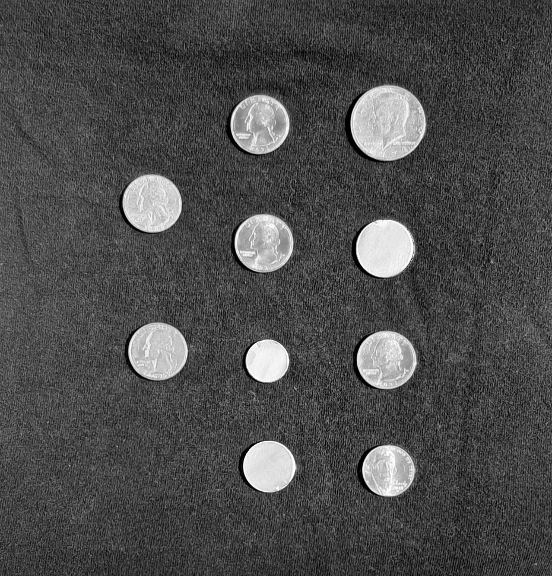

# Coin Segmentation and Classification


## Overview
This project aims to segment and classify coins from images using computer vision techniques. The main goal is to develop a pipeline that identifies and segments valid coins from images of coin collections, distinguishing them from blanks (non-coin regions). The project utilizes edge detection, morphological operations, and circle detection to extract the coins, and it classifies them based on their size.

### Features
- **Image Preprocessing**: Adjusting contrast and performing edge detection to highlight coin regions.
- **Coin Segmentation**: Identifying coins using circle detection and foreground segmentation.
- **Coin Classification**: Classifying coins into different categories (e.g., dimes, nickels, quarters, fifty-cent coins) based on their area.
- **USD Calculation**: Estimating the total value of the coins detected in the image.

## Techniques Used
- **Edge Detection**: Using the `edge` function to detect the edges of the coins and eliminate the blanks (non-coin regions).
- **Circle Detection**: Applying the `imfindcircles` function to detect circular objects (coins) within the image.
- **Morphological Operations**: Using erosion (`imerode`) and dilation (`imdilate`) to refine the mask of the detected coins.
- **Region Properties**: Using `regionprops` to measure the area of each detected coin and classify it accordingly.

## Workflow
1. **Load and Preprocess Image**: Load a coin image and preprocess it using contrast adjustment and masking.
2. **Edge Detection**: Apply the `edge` function to detect the edges in the image.
3. **Foreground Segmentation**: Segment the foreground (coins) from the background using a thresholding technique.
4. **Expand and Refine Edge Mask**: Dilate the edge mask and combine it with the foreground segmentation mask to focus on valid coin regions.
5. **Coin Classification**: Classify detected coins into different categories based on their area, such as:
    - Dimes
    - Nickels
    - Quarters
    - Fifty-cent coins
6. **Total Value Calculation**: Calculate the total value of the detected coins in USD.

## Installation
To run this project, ensure that you have MATLAB installed, along with the following toolboxes:
- Image Processing Toolbox

Clone the repository to your local machine:

```bash
git clone https://github.com/sirsjosh/Coin-Segmentation-and-Classification.git
